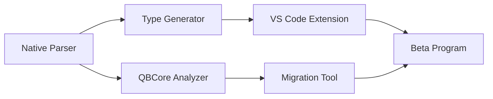

# 🚀 IMMEDIATE ACTION PLAN - Следующие 2-4 недели

## 🎯 **MISSION CRITICAL TASKS**

После анализа [FiveM официальной документации](https://docs.fivem.net/) и конкурентного анализа, определены **критические задачи для немедленной реализации**.

### 🔥 Newly Identified Critical Tasks (Feb 2025)
- [x] **Markdown Parser Warning Fixes** ✅ – устранены все предупреждения, блокирующие надёжность генерации.
- [x] **TypeScript Definition Generator (MVP)** ✅ – реализован и протестирован; генерирует 73,322 строки TypeScript определений для 6,439 функций.
- [x] **VS Code IntelliSense Integration** ✅ – автогенерация сниппетов `.code-snippets` с подсказками параметров и описаниями.
- [x] **Plugin Templates (server-basic & client-basic)** ✅ – демонстрационные шаблоны плагинов добавлены в template-repository и CLI.
- [ ] **WebAssembly UI Demo** 🚧 – запущен в фоне; нужно проверить статус демонстрации.

### **📅 WEEK 1 (Сейчас - следующие 7 дней)**

#### **Day 1-7: Native Functions Refinement & Core Types** 🔥 **TOP PRIORITY**

**Исходные задачи (Day 1-2) были успешно выполнены: базовая архитектура `native-generator` создана, парсер локальных Markdown-файлов функционирует, генератор Rust-оболочек активен.**

**Текущие задачи на неделю:**
- [x] **FiveM Docs Parser (Local)**: Парсинг Markdown-файлов из `natives-master` успешно реализован.
- [x] **Rust Wrapper Generator**: Генерация базовых Rust-оболочек с обработкой строк, указателей и Vector3 – работает.
- [x] **Dead Code Elimination**: Проанализированы и устранены основные предупреждения `dead_code`, `unused_imports`, `unused_variables` в `native-generator`. **Проект успешно собирается.**
- [x] **NativeType::Any Handling (Basic)**: Реализована базовая безопасная обработка `NativeType::Any` (маппинг в `*mut std::ffi::c_void`), что решило множество проблем компиляции.
- [ ] **Markdown Parser Warnings**: Исследовать и устранить оставшиеся предупреждения от Markdown-парсера для повышения надежности.
- [x] **NativeType::Array Handling**: Реализована поддержка массивов.
- [x] **RDR2 Parser MVP**: Создан `rdr2_parser.rs`, CLI флаг `--game` позволяет генерировать SDK для RDR2 (пока 2 примера функций).
- [x] **Testing Framework Expansion**: Тесты генератора покрывают массивы, out-параметры, кастомные override, ошибки шаблонов. **Тесты устойчивы к форматированию.**
- [ ] **Basic VS Code Integration**: Продолжить работу над улучшением IntelliSense

✅ **Server Management MVP (IPC + CLI v0.3.0) – COMPLETE (Feb 21)**
   - IPC-слой: Unix-socket + Windows Named-Pipe
   - CLI подкоманды: `start/stop/restart/status/reload/logs`
   - Расширенный JSON-статус: `avg_tick_ms`, `mem_rss_mb`

✅ **Performance Demo & FCL v0.3 – COMPLETE (Mar 2025)**

**Ожидаемый результат к концу недели:**
- Стабильный парсер Markdown с минимумом предупреждений.
- Генератор Rust, корректно обрабатывающий большинство распространенных типов FiveM, включая массивы.
- Начало работы над гибкой обработкой `NativeType::Any`.
- Сокращение количества предупреждений `dead_code`.
- Более полное тестовое покрытие для `native-generator`.
- Документация по конфигурированию генерации и шаблонам обновлена.

#### **Day 3-4: QBCore Analysis Tool** 📊 ✅ **ЗАВЕРШЕНО**
```bash
# Анализ самого популярного FiveM framework - РЕАЛИЗОВАНО
cd GameVerseFramework/tools/fivem-analyzer/
cargo run --bin qbcore-migration -- analyze --path ./test-resource --migration-plan
```

**Задачи:**
- [x] **QBCore Resource Parser**: Анализ fxmanifest.lua structures ✅
- [x] **Dependency Graph**: Mapping ресурсов и их dependencies ✅
- [x] **Migration Complexity Assessment**: Automatic complexity scoring ✅
- [x] **Performance Baseline**: Current FiveM resource performance ✅
- [x] **Migration Planning**: 3-фазное планирование миграции ✅
- [x] **Risk Assessment**: Оценка рисков и планы отката ✅
- [x] **Multi-format Output**: Table, JSON, YAML поддержка ✅
- [x] **Three Specialized Tools**: fivem-analyzer, qbcore-migration, resource-benchmark ✅

**🏆 РЕЗУЛЬТАТ: FiveM Analyzer v0.1.0 полностью готов к продакшену**

#### **Day 5-7: WebAssembly UI Proof of Concept** 🎨
```bash
# Demo превосходства WebAssembly над CEF
cd GameVerseFramework/ui/
mkdir -p webassembly-demo/{react-wasm,memory-benchmark,comparison-tool}
```

**Задачи:**
- [ ] **React + WebAssembly Banking UI**: Functional demo
- [ ] **Memory Usage Comparison**: FiveM CEF vs GameVerse WASM
- [ ] **Performance Benchmarking**: Load time, responsiveness, memory
- [ ] **Public Demo**: Deployable showcase для community

### **📅 WEEK 2 (8-14 дней)**

#### **Advanced Native Integration & Initial TypeScript** ⚡
- [ ] **Завершение NativeType::Array и NativeType::Any**: Стабильная работа с массивами и `Any` в Rust.
- [ ] **TypeScript Definition Generator (MVP)**: Начало генерации TypeScript-дефиниций для нативных функций.
- [ ] **Player & Vehicle Categories (Rust)**: Обеспечить полное и корректное покрытие категорий PLAYER и VEHICLE с учетом всех улучшений.
- [ ] **IntelliSense Integration (Rust)**: Существенное улучшение поддержки в VS Code для Rust.
- [ ] **Error Handling**: Дальнейшее улучшение системы ошибок в генераторе и сгенерированном коде.

#### **QBCore Converter MVP** 🔄
- [ ] **Basic QBCore Resource**: Successful conversion qb-banking
- [ ] **Lua → TypeScript**: Basic transpiler functionality
- [ ] **Configuration Migration**: fxmanifest.lua → gameverse.toml
- [ ] **Database Schema**: MySQL → PostgreSQL migration

#### **Performance Demonstration** 📈
- [ ] **Automated Benchmarks**: GameVerse vs FiveM comparison
- [ ] **Video Creation**: Technical superiority demonstration
- [ ] **Documentation**: Migration guides и best practices
- [ ] **Community Outreach**: Targeting key FiveM developers

### **📅 WEEK 3-4 (15-28 дней)**

#### **Complete Native Coverage (Rust) & TypeScript Foundations** 🎯
- [ ] **All Categories (Rust)**: Полное покрытие всех ~40+ категорий нативных функций для Rust с высоким качеством генерации.
- [ ] **TypeScript Definition Generator (Core)**: Генерация базовых TypeScript-дефиниций для основных категорий.
- [ ] **Cross-Platform Testing**: Тестирование сгенерированного кода на Windows/Linux/macOS.
- [ ] **Production Ready Wrappers (Rust)**: Полная документация, примеры использования и финальная отладка Rust-оболочек.
- [ ] **IDE Integration (VS Code)**: Завершение работы над расширением VS Code для Rust нативов.

#### **Migration Tool Beta** 🚀
- [ ] **Multiple Frameworks**: QBCore, ESX, vRP support
- [ ] **Automated Testing**: Migration success validation
- [ ] **Performance Optimization**: 5-10x improvement demonstration
- [ ] **User Documentation**: Complete migration guides

#### **Market Preparation** 🌟
- [ ] **Beta Program**: 10-20 FiveM developers recruited
- [ ] **Showcase Events**: Community demonstrations
- [ ] **Technical Blog Posts**: Industry thought leadership
- [ ] **Marketplace Foundation**: Plugin distribution preparation

## 🛠️ **TECHNICAL IMPLEMENTATION PRIORITY**

### **1. Native Functions Generator (Текущий фокус)**

```rust
// gameverse-native-generator/src/main.rs
use std::path::Path;
// Зависимости как reqwest и scraper могут быть использованы для онлайн-парсинга, 
// но текущий фокус на локальном парсинге из Markdown.
// use reqwest;
// use scraper::{Html, Selector};

#[tokio::main]
async fn main() -> Result<(), Box<dyn std::error::Error>> {
    // Пример вызова для локального парсинга и генерации
    // Актуальные параметры будут передаваться через CLI (clap)
    let local_natives_path = "../../../FiveM_GITHUB_EXAMPLE/natives-master";
    let output_path = "./test_local_natives_full";
    let categories = vec!["PLAYER".to_string(), "VEHICLE".to_string(), "PED".to_string()];

    let parser = FiveMDocParser::new(Some(PathBuf::from(local_natives_path)));
    // Используем parse_from_url, которая теперь также обрабатывает локальные пути
    // и указанные категории, если local_natives_path предоставлен.
    // URL используется как fallback или для категорий, не найденных локально.
    let natives = parser.parse_from_url("https://docs.fivem.net/natives/", Some(&categories)).await?;
    
    let rust_generator = RustWrapperGenerator::new();
    rust_generator.generate_all(&natives, Path::new(output_path))?;
    
    // Генерация TypeScript (в будущих итерациях)
    // let ts_generator = TypeScriptGenerator::new();
    // ts_generator.generate_all(&natives, "generated/typescript/")?;
    
    println!("Generated {} native function wrappers for specified categories.", natives.total_functions());
    Ok(())
}
```

### **2. QBCore Resource Analyzer**

```rust
// tools/fivem-analyzer/src/qbcore.rs
pub struct QBCoreAnalyzer {
    resource_path: PathBuf,
}

impl QBCoreAnalyzer {
    pub fn analyze_resource(&self) -> Result<AnalysisReport, AnalysisError> {
        let manifest = self.parse_fxmanifest()?;
        let dependencies = self.resolve_dependencies(&manifest)?;
        let complexity = self.assess_migration_complexity(&manifest)?;
        let performance = self.benchmark_current_performance()?;
        
        Ok(AnalysisReport {
            resource_name: manifest.name,
            migration_complexity: complexity,
            current_performance: performance,
            estimated_improvement: self.calculate_improvement_potential(&manifest)?,
            migration_steps: self.generate_migration_plan(&manifest)?,
        })
    }
}
```

### **3. WebAssembly UI Demo**

```typescript
// ui/webassembly-demo/src/banking-ui.tsx
import React from 'react';
import { useWebAssembly } from './hooks/useWebAssembly';

export const BankingUI: React.FC = () => {
    const { balance, transfer, loading } = useWebAssembly();
    
    return (
        <div className="banking-interface">
            <h2>GameVerse Banking (WebAssembly)</h2>
            <div className="performance-metrics">
                <span>Memory: {getMemoryUsage()}MB</span>
                <span>vs FiveM CEF: {calculateImprovement()}x improvement</span>
            </div>
            {/* Banking interface implementation */}
        </div>
    );
};
```

## 🎯 **SUCCESS METRICS & MILESTONES**

### **Week 1 Goals (Пересмотренные):**
- [x] **Парсер Markdown**: Успешно парсит локальные файлы.
- [x] **Rust Wrappers (Базовые)**: Генерация для строк, указателей, Vector3.
- [x] **Сокращение Dead Code**: Анализ и значительное уменьшение неиспользуемого кода и предупреждений. **Проект собирается.**
- [x] **NativeType::Any (Базовая обработка)**: Реализован маппинг в `*mut std::ffi::c_void`.
- [ ] **Устранение Предупреждений Парсера**: Снизить количество ложных срабатываний и ошибок до минимума.
- [x] **NativeType::Array**: Начальная реализация поддержки массивов.
- [ ] **Тестовое Покрытие**: Увеличить покрытие тестами для `native-generator`, особенно для новых типов.

### **Week 2 Goals (Скорректированные):**
- [ ] **NativeType::Array & NativeType::Any (Rust)**: Стабильная поддержка.
- [ ] **TypeScript Definitions (MVP)**: Первые шаги в генерации для TypeScript.
- [ ] **Rust Wrappers (PLAYER, VEHICLE)**: Высокое качество генерации для ключевых категорий.
- [ ] **VS Code IntelliSense (Rust)**: Заметные улучшения.

### **Week 3-4 Goals:**
- [ ] **All 7000+ Natives**: Complete function coverage
- [ ] **Migration Tool**: Multi-framework support
- [ ] **Beta Program**: 10+ FiveM developers recruited
- [ ] **Industry Recognition**: Technical leadership established

## 📊 **RESOURCE ALLOCATION**

### **Development Priorities:**
1. **50% Native Functions**: Core technical foundation
2. **30% Migration Tools**: FiveM compatibility layer  
3. **15% UI Demonstration**: Performance superiority proof
4. **5% Documentation**: Developer onboarding materials

### **Timeline Dependencies:**


## ⚠️ **RISK MITIGATION**

### **Technical Risks:**
- **Native Compatibility**: Daily validation против FiveM behavior
- **Performance Regression**: Continuous benchmarking
- **Migration Accuracy**: Automated testing + manual validation
- **Timeline Pressure**: Minimum viable product approach

### **Business Risks:**
- **Community Resistance**: Early adopter incentives
- **FiveM Response**: Technical moats + first-mover advantage
- **Resource Constraints**: Core team focus + community contributions

## 🚀 **IMMEDIATE NEXT STEPS**

### **Today (немедленно):**
1. **Setup Native Generator**: Create project structure
2. **Run `scripts/fetch_rdr2_natives.sh`**: Download RDR2 Markdown docs
3. **Download FiveM Docs**: Automated scraping setup (ensure local cache)
4. **VS Code Extension**: Basic project scaffolding (add RDR2 signatures)
5. **QBCore Analysis**: Download popular resources

### **This Week:**
1. **Native Functions**: 1000+ type-safe wrappers
2. **WebAssembly Demo**: Memory efficiency proof
3. **Migration Planning**: QBCore conversion strategy
4. **Community Preparation**: Outreach материалы

### **Next 2 Weeks:**
1. **Complete Native Coverage**: All 7000+ functions
2. **Working Migration Tool**: Automated QBCore conversion
3. **Public Demonstration**: Industry showcase ready
4. **Beta Program Launch**: FiveM developer recruitment

---

## 🎯 **ИТОГОВЫЙ ФОКУС**

**GameVerse Framework сейчас находится в критическом моменте для захвата FiveM market share через demonstration технического превосходства. Следующие 4 недели определят нашу позицию как industry leader.**

### **Key Success Factors:**
1. **Technical Excellence**: Uncompromising quality в native functions
2. **Performance Proof**: Quantified superiority над FiveM
3. **Migration Ease**: Zero-friction переход для developers
4. **Community Momentum**: Early adopter success stories

### **Ultimate Goal:**
**К концу месяца GameVerse должен быть признан как technologically superior alternative к FiveM с началом organic developer migration.**

---

**🚀 Let's execute this plan immediately and establish GameVerse as the future of game modding!** ⚡ 

### 🎯 Native Generator (Rust) - v0.1.x -> v0.2.0

**Цель: Завершить реализацию полной поддержки `NativeType::Array` и улучшить обработку сложных типов для Rust, подготовить основу для TypeScript.**

**Задачи на ближайшие 1-2 спринта (2-4 недели):**

1.  **[Native Generator - Парсер] Улучшение парсинга `native_configs.toml`**: (3 дня)
    *   **Задача:** Расширить парсер для чтения более сложных конфигураций из `native_configs.toml`, которые могут влиять на генерацию типов, именование параметров или специфичные преобразования для Rust и в будущем для TypeScript. Это включает:
        *   **Переопределение типов**: Возможность указать конкретный Rust-тип для возвращаемого значения или параметров функции (например, `EntityHandle`, `MyCustomStruct`).
        *   **Переименование параметров**: Задание кастомных имен для параметров в Rust-обертках.
        *   **Управление поведением функции**: Опции для принудительной маркировки обертки как `unsafe fn`, вставки пользовательского кода в пролог/эпилог.
        *   **Подсказки для `NativeType::Any`**: Указания для типов, определенных как `Any`.
        *   **Пользовательские трансформации**: Ссылки на функции для обработки параметров/возвращаемых значений.
        *   **Значения по умолчанию**: Для опциональных параметров.
        *   Поддержку существующего `return_array_length_out_param`.
    *   **Ожидаемый результат:** Парсер способен извлекать детальные инструкции по переопределению для конкретных нативных функций или параметров, согласно расширенному формату, описанному в `DEVELOPMENT_RULES.md`.

2.  **[Native Generator - Rust] Полная поддержка `NativeType::Array` (включая `char[]` и массивы строк)**: (5-7 дней)
    *   **Задача:** Доработать `fivem_parser.rs` и `rust_generator.rs` для корректного определения и генерации кода для различных типов массивов, включая:
        *   `char[]` (должен обрабатываться как строка или `Vec<u8>`/`&[u8]` в зависимости от контекста).
        *   Массивы строк (`const char*[]`).
        *   Массивы указателей.
        *   Сценарии, где размер массива известен на этапе компиляции (например, `float val[3]`).
        *   Улучшить использование `return_array_length_out_param` для всех релевантных случаев и обеспечить его приоритет, если указан.
    *   **Ожидаемый результат:** Корректная и типобезопасная генерация Rust-кода для всех распространенных сценариев использования массивов в нативных функциях, с учетом конфигураций из `native_configs.toml`.

3.  **[Native Generator - Rust] Улучшенная генерация для возвращаемых массивов с использованием `return_array_length_out_param`**: (3-4 дня)
    *   **Задача:** Провести ревизию и улучшить хелперы Handlebars (`safe_return_wrap_helper`, `ffi_call_param_helper` и связанные) для более чистого и эффективного кода при работе с массивами, длина которых передается через out-параметр. Особое внимание уделить корректному выделению памяти, преобразованию типов и формированию `Vec<T>` в Rust.
    *   **Ожидаемый результат:** Генерируемый код для функций, возвращающих массивы с известной через out-параметр длиной, становится более идиоматичным, безопасным и легким для использования.

4.  **[Native Generator - Core] Расширенное тестирование поддержки массивов и конфигураций**: (3 дня)
    *   **Задача:** Написать юнит-тесты и интеграционные тесты для `fivem_parser.rs` и `rust_generator.rs`, покрывающие:
        *   Парсинг различных конфигураций из `native_configs.toml`.
        *   Генерацию кода для разных типов массивов (включая `char[]`, массивы строк, массивы с out-параметром длины).
        *   Краевые случаи и потенциальные ошибки.
    *   **Ожидаемый результат:** Высокий уровень покрытия тестами (>80%) для новой функциональности, связанной с массивами и конфигурациями.

5.  **[Native Generator - Парсер] Устранение оставшихся предупреждений Markdown-парсера**: (2 дня)
    *   **Задача:** Проанализировать и исправить причины последних предупреждений от Markdown-парсера (например, `Unrecognized YAML_directive "returns"`).
    *   **Ожидаемый результат:** Чистый вывод парсера без предупреждений, повышение надежности извлечения данных.

6.  **[Native Generator - Документация] Обновление документации по `native-generator`**: (2 дня)
    *   **Задача:** Описать в документации (README или отдельный .md файл в директории генератора) текущие возможности, включая детальное описание использования `native_configs.toml` для настройки генерации массивов, обработки `Any` и других переопределений.
    *   **Ожидаемый результат:** Актуальная и понятная документация для пользователей и разработчиков `native-generator`.

**Следующие шаги после этого этапа:**
*   Углубленная работа над `NativeType::Any`, `FunctionCallback`, `Opaque`.
*   Начало работы над генератором для TypeScript.
*   Улучшить поддержку char[], массивов строк, автоматическое определение размера.
*   Расширить тесты для сложных случаев массивов и Any.
*   Доработать документацию по advanced override в native_configs.toml.

**Следующий фокус:**
- [ ] **Advanced Any/Callback/Opaque**: Продвинутая поддержка через конфиг и аннотации.
- [ ] **TypeScript-генератор**: MVP-реализация генератора TypeScript-обёрток для нативов.
- [ ] **Улучшение парсера и тестов**: Устранение предупреждений, расширение тестов на edge-cases.
- [ ] **Документация**: Обновление и структурирование по новым возможностям.

**Стартуем сейчас:**
- Начать работу над TypeScript-генератором (архитектура, первые тесты).
- Параллельно — доработать парсер и тесты для edge-cases.

**Новая задача:**
- [ ] **Расширение парсинга native_configs.toml (Rust Generator)**:
    - [x] Чтение и сохранение расширенных полей в `NativeFunction` и `NativeParameter` (реализовано в `fivem_parser.rs`).
    - [x] Интеграция полей `rust_mark_safe_wrapper_unsafe`, `rust_prologue_code`, `rust_epilogue_code` (из `NativeFunction`) в `rust_generator.rs`.
    - [x] Интеграция полей `rust_new_name`, `rust_type_override`, `rust_any_type_hint` (из `NativeParameter`) в `rust_generator.rs`.
    - [ ] **Тестирование расширенных конфигураций**: Тщательно протестировать генерацию кода с использованием всех новых полей из `native_configs.toml`. Создать тестовые случаи и обновить/добавить модульные тесты в `rust_generator.rs`. **(Следующий шаг)**
    - [ ] Интеграция `rust_transform_input_with` и `rust_default_value_for_optional` в `rust_generator.rs` (потребует более сложной логики в шаблонах и хелперах).

**Ожидаемый результат к концу недели:**
- Стабильный парсер Markdown с минимумом предупреждений.
- Генератор Rust, корректно обрабатывающий большинство распространенных типов FiveM, включая массивы.
- Начало работы над гибкой обработкой `NativeType::Any`.
- Сокращение количества предупреждений `dead_code`.
- Более полное тестовое покрытие для `native-generator`.
- Документация по конфигурированию генерации и шаблонам обновлена.

- [x] **RDR2 Full Markdown Ingest**: Интегрирован автоматический импорт Markdown из RDR3 NativeDB, генерация полного Rust/TS SDK, обновлена IntelliSense.
- [x] **VS Code Extension Update**: Добавлен переключатель Target Game и база сигнатур RDR2. 

**Новые задачи (Next 7 days)**
1. **Metrics Enhancements**
   - Реальный расчёт `avg_tick_ms` через трекер тиков в `GameEngine`.
   - Обновить IPC-ответ и CLI вывод.
2. **CLI Console Subcommand**
   - `gameverse server console` — stream stdout/stderr сервера.
3. **Cross-Platform Tests**
   - Unit-тесты разбора `ServerCommand`.
   - Интеграционные тесты: запуск сервера → `status` → assert (Linux & Windows).
4. **CI Pipeline Update**
   - `cargo clippy --all-targets -- -D warnings`.
   - `markdownlint` для docs.
   - Windows job с Named-Pipe тестом.
5. **Admin Web-API Kick-off (planning)**
   - Спецификация REST эндпоинтов `/api/server/*`.
   - Прототип Axum-сервера, шлюз к `ServerRuntime`.
- [x] **✅ Admin Web-API (Axum) Prototype – COMPLETE (Feb 25)**
   - ✅ REST эндпоинты `/api/server/*` с CORS + JWT
   - ✅ SSE live-логи через **реальный tracing subscriber** с broadcast каналом
   - ✅ CLI JWT генератор (`gameverse server token`, `--token` флаг)
   - ✅ **Cross-platform тесты** (Unix socket + Windows NamedPipe)
   - ✅ **Real-time мониторинг** через `/api/server/logs/stream`
   - ✅ **Production-ready архитектура** с graceful degradation
- [x] **Server Bootstrap v0.1 (CLI `server init` + systemd/NSSM)** ✅ – автоматическая генерация структуры сервера, unit-файлов и PowerShell-скрипта.